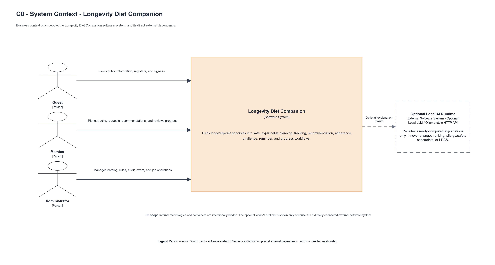
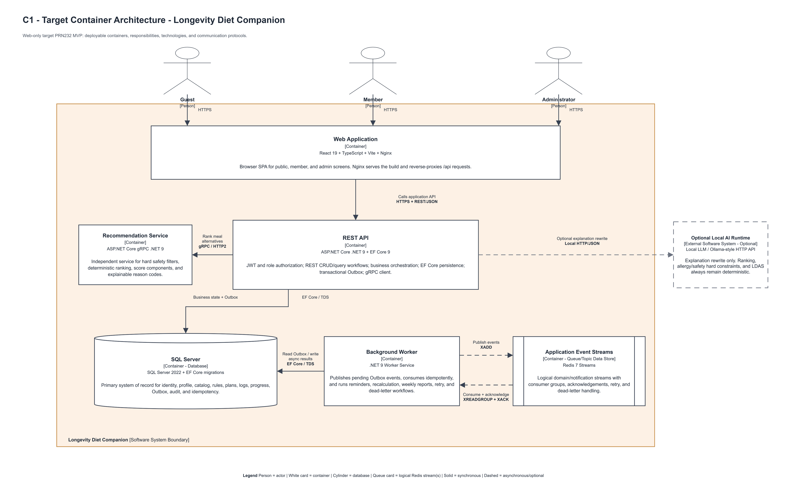
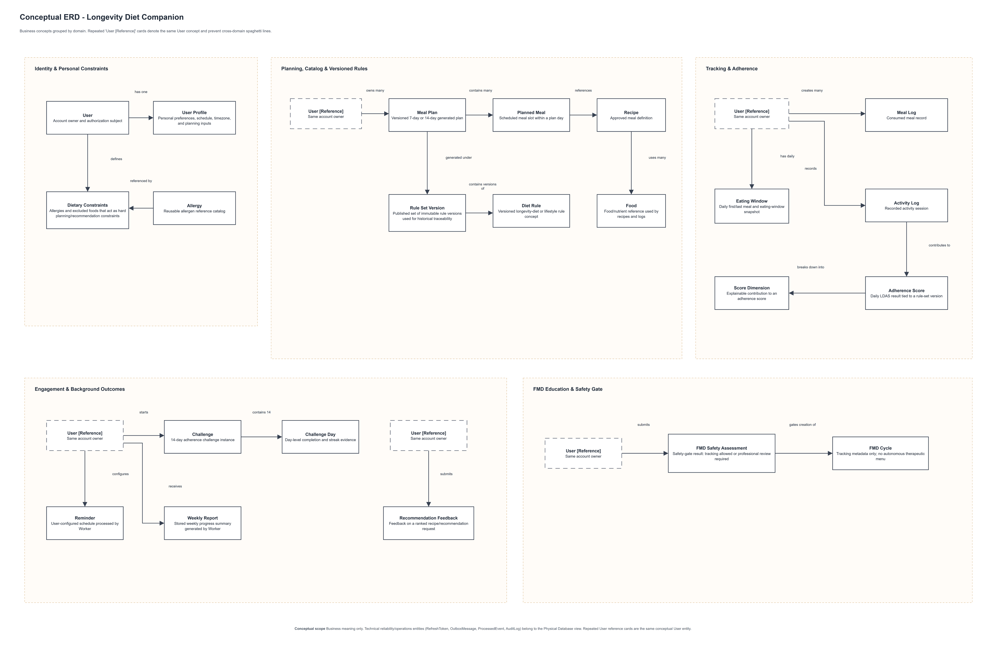
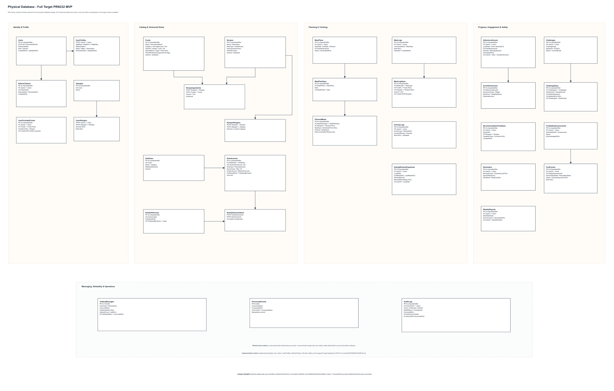

# Longevity Diet Companion - Assignment Foundation & Architecture Pack

> **Scope:** PRN232 target Assignment MVP  
> **Architecture:** Assignment C0 + C1, aligned with the official C4 model concepts  
> **Product boundary:** wellness / education / adherence support; not a medical device

This document is the concise submission-facing view of the project. Detailed engineering specifications remain in the parent `docs/` folder.

## 1. Context

People can understand general longevity-diet principles but still struggle to turn them into repeatable daily behaviour. They must decide what to eat, when to eat, how to track meals and activity, and how to understand whether they are following the intended principles.

**Longevity Diet Companion (LDC)** converts public longevity-diet principles into practical, explainable daily workflows for planning, tracking, recommendations and progress.

LDC does **not** diagnose disease, prescribe treatment, predict lifespan or autonomously generate therapeutic fasting protocols.

## 2. Problems

1. **Knowledge-to-action gap:** understanding principles does not automatically create consistent daily habits.
2. **Personal constraints:** allergies, exclusions, preferences and schedules make one generic plan unsuitable.
3. **Opaque feedback:** a score or recommendation is weak if the user cannot understand why it was produced.
4. **Fragmented progress:** meals, activity, eating window and adherence are often tracked separately.
5. **Safety-sensitive fasting content:** FMD-related material needs a separate safety gate.
6. **Assignment integration:** REST, JWT, SQL, gRPC, Redis Streams, background work and Docker must form one coherent business flow.
## 3. Solutions

1. **Guided onboarding and profile** - capture preferences, exclusions, allergies and schedule once.
2. **Rule-based meal planning** - generate 7-day or 14-day plans using active rules and hard safety constraints.
3. **Explainable recommendation** - use an independent gRPC service for deterministic ranking and reason codes.
4. **Unified tracking and progress** - combine meal logs, eating window, activity and LDAS in one workflow.
5. **Reliable background automation** - use a transactional Outbox, Redis Streams and a Worker for asynchronous processing.
6. **Safety-first FMD boundary** - separate FMD education/tracking from normal planning and require a safety gate.

## 4. Main Actors

| Actor | Main responsibilities |
|---|---|
| **Guest** | View public information; register and sign in. |
| **Member** | Manage profile; generate plans; log meals/activity; track eating window; view LDAS/progress; request recommendations; join challenge; configure reminders. |
| **Administrator** | Manage food/recipe catalog and versioned diet rules; inspect audit/event/job status; maintain reference data. |

## 5. Main Features

1. Authentication and Profile
2. Food and Recipe Catalog
3. Diet Rule Catalog and Versioning
4. 7-Day / 14-Day Meal Plan Generation
5. Meal and Eating-Window Tracking
6. Activity Tracking
7. Longevity Diet Adherence Score (LDAS)
8. gRPC Meal Recommendation
9. 14-Day Adherence Challenge
10. Reminder and Weekly Report
11. FMD Education and Safety Gate
12. Admin Catalog, Rule, Audit and Event Management
## 6. System Architecture - C4

The Assignment asks for two architecture levels named **C0** and **C1**. In this project:

- **C0 = System Context** for the Assignment.
- **C1 = Container Architecture** for the Assignment.

The official C4 model calls these views **System Context** and **Container**. The Assignment labels are preserved in the filenames and titles.

### 6.1 C0 - System Context

**Purpose:** show LDC as one software system, the people directly interacting with it, and direct external software dependencies.

| Source | Destination | Relationship |
|---|---|---|
| Guest | Longevity Diet Companion | Views public information and registers/signs in |
| Member | Longevity Diet Companion | Plans, tracks and reviews personal adherence progress |
| Administrator | Longevity Diet Companion | Manages catalog, rules and operational/audit data |
| Longevity Diet Companion | Optional Local AI Runtime | Optionally rewrites deterministic structured explanations; does not change safety/ranking |

**Intentionally hidden at C0:** React, REST API, SQL Server, Redis, gRPC, Worker, Controllers, Services and Repositories. The optional local AI runtime is shown because it is a direct external software dependency of the whole system.
### 6.2 C1 - Container Architecture

**Purpose:** zoom into the LDC software-system boundary and show the target deployable/runnable applications, data stores and runtime communication for the completed Assignment MVP. The product is web-only; there is no Mobile App container.

| Container | Technology | Responsibility |
|---|---|---|
| **Web Application** | React 19, TypeScript, Vite, Nginx | SPA UI; serves assets; reverse-proxies `/api` requests. |
| **REST API** | ASP.NET Core .NET 9 | JWT; REST/JSON endpoints; business orchestration; EF Core; gRPC client. |
| **Recommendation Service** | ASP.NET Core gRPC .NET 9 | Hard safety filters; deterministic ranking; reason codes. |
| **SQL Server** | SQL Server 2022 + EF Core | Primary system of record and transactional Outbox. |
| **Background Worker** | .NET 9 Worker Service | Outbox publisher; Redis consumers; reminders; recalculation; weekly jobs. |
| **Application Event Streams** | Redis 7 Streams | Logical queue/topic-style data stores for asynchronous domain/notification events, consumer-group processing, acknowledgement, retry and dead-letter handling. |
| **Optional Local AI Runtime** | Local LLM / Ollama-style HTTP API | Optional explanation rewrite only; deterministic ranking, safety constraints and LDAS remain authoritative. |

### 6.3 Core Runtime Relationships

| Source | Destination | Technology / intent |
|---|---|---|
| Browser / actor | Web Application | HTTPS |
| Web Application | REST API | HTTPS + REST/JSON |
| REST API | SQL Server | EF Core / TDS - business state + Outbox |
| REST API | Recommendation Service | gRPC / HTTP2 |
| Background Worker | SQL Server | EF Core / TDS - read Outbox + write async results |
| Background Worker | Application Event Streams | Redis Streams XADD - publish pending events |
| Application Event Streams | Background Worker | Redis Streams XREADGROUP + XACK - consume/acknowledge |
| REST API | Optional Local AI Runtime | Local HTTP/JSON - optional explanation rewrite only |
### 6.4 Architecture Invariants

- Browser never connects directly to SQL Server, Redis or gRPC.
- API internal **Controller -> Service -> Repository** layers are not separate C1 containers.
- API does not dual-write SQL + Redis in the request path.
- Business state and `OutboxMessage` are committed in one SQL transaction.
- Worker publishes pending Outbox messages to logical Application Event Streams implemented with Redis 7 Streams.
- The C4 model represents the logical streams/queues as containers (data stores), not the Redis broker/server itself.
- Consumers are idempotent through `ProcessedEvent`.
- Recommendation ranking and safety constraints are deterministic.
- Optional AI may explain existing reasons only; it cannot override safety/ranking.

### 6.5 Main Flows

**Synchronous:**  
`React -> REST API -> Service -> Repository -> SQL Server`

**Recommendation:**  
`React -> REST API -> gRPC Client -> Recommendation Service -> ranked result -> REST DTO -> React`

**Asynchronous:**  
`REST API -> SQL + Outbox -> Worker publisher -> Redis Streams -> Worker consumer -> ProcessedEvent / async result`

## 7. Technology

| Area | Technology |
|---|---|
| Frontend | React 19, TypeScript, Vite, Nginx |
| REST API | ASP.NET Core .NET 9 |
| Application layer | .NET Services |
| Persistence | EF Core 9 |
| Database | SQL Server 2022 |
| Recommendation | ASP.NET Core gRPC .NET 9 |
| Messaging | Redis 7 Streams |
| Background processing | .NET 9 Worker Service |
| Security | JWT + rotating refresh token |
| API documentation | OpenAPI + Swagger UI |
| Deployment | Docker + Docker Compose |
| Testing | xUnit, WebApplicationFactory, Playwright |
## 8. ERD - Conceptual

The conceptual ERD contains business concepts only. SQL types, refresh tokens, Outbox, ProcessedEvent and other technical infrastructure are intentionally excluded.

### Main Business Relationships

- User **has one** User Profile.
- User **has many** Meal Plans.
- Meal Plan **contains many** Planned Meals.
- Planned Meal **references one** Recipe.
- Recipe **uses many** Foods.
- User **creates many** Meal Logs.
- User **creates many** Activity Logs.
- User **receives many** Adherence Scores.
- Diet Rules **govern** plan generation and adherence scoring.

## 9. Physical Database

The physical view shows the **full 33-table Target Assignment MVP** defined by the project database design. To keep the page readable, every table shows its primary/foreign keys plus the important implementation fields; cross-domain foreign keys are written inside table cards instead of drawing long spaghetti lines.

For deep zoom and printing, use `vector/04-physical-database.svg`. Five domain-specific PNG crops are also generated under `previews/physical-db-sections/` so each table remains easy to read without making the master diagram visually crowded.

### Full Table Groups

**Identity & Profile (6)**
- Users
- UserProfiles
- RefreshTokens
- Allergies
- UserAllergies
- UserExcludedFoods

**Catalog & Versioned Rules (8)**
- Foods
- Recipes
- RecipeIngredients
- RecipeAllergens
- DietRules
- RuleVersions
- RuleSetVersions
- RuleSetVersionItems

**Planning & Tracking (7)**
- MealPlans
- MealPlanDays
- PlannedMeals
- MealLogs
- MealLogItems
- ActivityLogs
- EatingWindowSnapshots

**Progress, Engagement & Safety (9)**
- AdherenceScores
- ScoreDimensions
- Challenges
- ChallengeDays
- RecommendationFeedback
- FmdSafetyAssessments
- FmdCycles
- Reminders
- WeeklyReports

**Messaging, Reliability & Operations (3)**
- OutboxMessages
- ProcessedEvents
- AuditLogs

### Important Integrity Rules

1. `Users.NormalizedEmail` is unique.
2. `RefreshTokens.TokenHash` is unique.
3. `RecipeIngredients(RecipeId, FoodId)` uses a composite key.
4. `RuleVersions(DietRuleId, VersionNumber)` is unique.
5. `MealPlanDays(MealPlanId, Date)` is unique.
6. Referenced catalog data uses deactivation/soft-delete rather than destructive deletion.
7. Published rule versions are immutable.
8. Pending Outbox rows are indexed for publisher polling.
9. Event consumers are idempotent through ProcessedEvents.
## 10. PRN232 Assignment Coverage

The project is intentionally mapped to the mandatory distributed-application requirements in the supplied PRN232 Final Assignment PDF.

| Assignment requirement | Longevity Diet Companion evidence |
|---|---|
| ASP.NET Core REST API | `LongevityDiet.API` (.NET 9) |
| RESTful CRUD | Profile, catalog, plans, logs, rules, reminders and other target resources |
| Layered architecture | Controller/API -> Services -> Repository -> EF Core |
| JWT authentication | JWT access token + rotating refresh token |
| Search/filter/sort/pagination | Food, recipe and admin collection queries |
| Background processing | `LongevityDiet.Worker`: Outbox, reminders, weekly reports, recalculation, retry/DLQ |
| Message Broker | Redis Streams |
| Producer + consumer | Worker XADD publisher + Worker consumer group XREADGROUP/XACK |
| Independent gRPC service | `LongevityDiet.Recommendation.Grpc` |
| REST-to-gRPC interaction | REST API -> Recommendation Service via gRPC/HTTP2 |
| Relational persistence | EF Core 9 + SQL Server 2022 |
| DI/config/logging/exceptions | ASP.NET Core DI/config + Serilog + ProblemDetails |
| Docker containerization | Web/API/gRPC/Worker/SQL/Redis Dockerfiles + Docker Compose |
| API documentation | OpenAPI + Swagger UI |

### Required Deliverables

- Complete source code.
- Database migrations/scripts.
- Dockerfile(s).
- Docker Compose configuration.
- Swagger/OpenAPI API documentation.
- README containing project description, system architecture, technology stack, installation guide, deployment instructions and member responsibilities.

### Final Demonstration Evidence

The final presentation must be able to demonstrate, in one coherent flow:

1. System architecture.
2. REST API functionality.
3. Background job execution.
4. Message publishing and consuming.
5. gRPC communication.
6. Docker/Compose deployment and service communication.
7. End-to-end business workflow: authenticate -> profile -> plan/log -> recommendation -> adherence/progress -> background report/event evidence.

### Assessment Awareness

| Assessment criterion | Weight |
|---|---:|
| System architecture and design | 20% |
| REST API implementation | 20% |
| Background Job | 10% |
| Message Broker integration | 15% |
| gRPC service | 15% |
| Docker/Cloud deployment | 10% |
| Documentation and presentation | 10% |

## 11. Scope and Implementation Status

### In Scope for the Target Assignment MVP
All 12 main product features plus REST, JWT, layered architecture, SQL Server/EF Core, independent gRPC, Redis Streams producer/consumer, Background Worker, Docker Compose and end-to-end demo evidence.

### Out of Scope
Payment, social network, wearable integration, telemedicine, custom ML model training, diagnosis/treatment and lifespan prediction.

### Implemented Baseline at this stage
- Web container baseline
- REST API
- SQL Server
- JWT/profile identity foundation
- Docker Compose
- gRPC deployable shell
- Worker deployable shell

The C1 and database diagrams represent the agreed **target Assignment MVP**. Implementation status is tracked separately so the documentation does not claim planned business logic is already finished.

## 12. References

- Official C4 Model: https://c4model.com/
- C4 skill: https://github.com/bitsmuggler/c4-skill
- BMAD Explore and Validate: https://docs.bmad-method.org/plan/explore-and-validate-an-idea/
- Project source of truth: current code, `docker-compose.yml`, engineering docs and ADRs in this repository.
